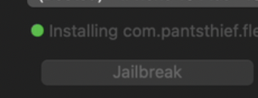
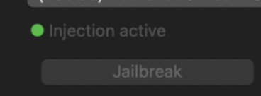
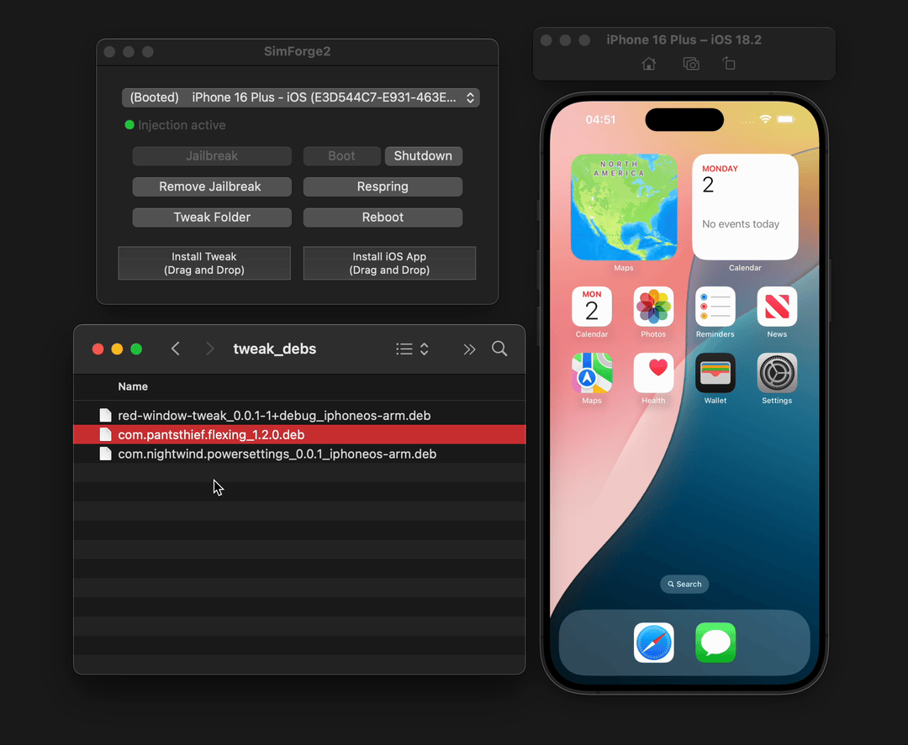
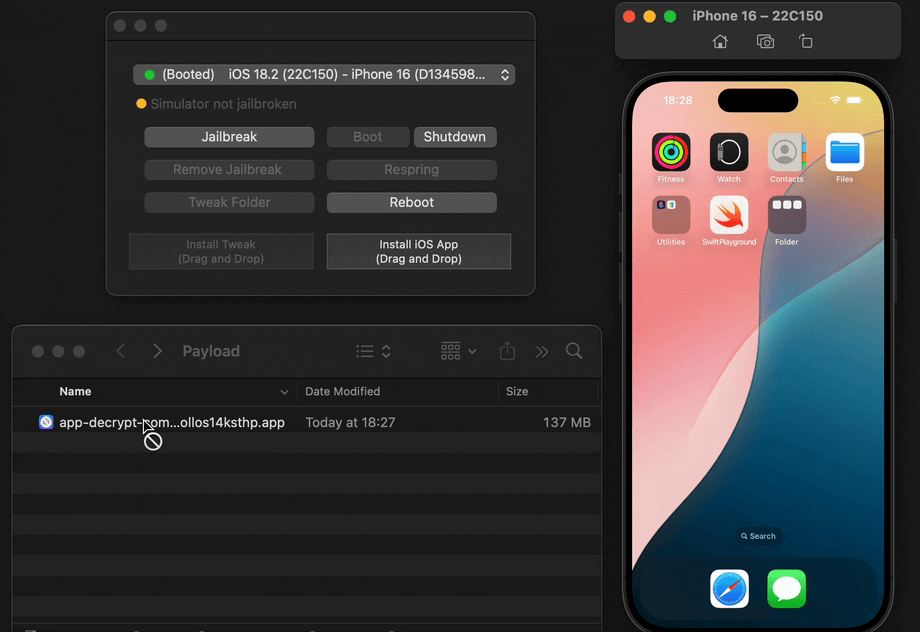
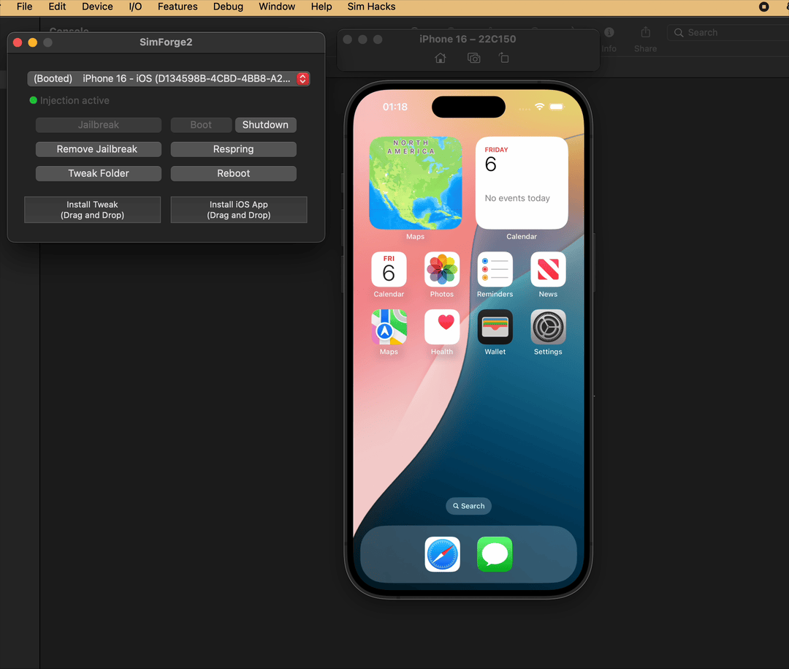

# Authorization Fix for simulator-trainer

## Problem

The simulator-trainer application was failing to jailbreak iOS simulators with the following error:

```
Failed to jailbreak device with error: Error Domain=NSCocoaErrorDomain Code=1 "Failed to mount tmpfs overlays: Error Domain=NSOSStatusErrorDomain Code=-60005 "errAuthorizationDenied: The authorization was denied."
```

This error occurred when attempting to use the privileged helper tool to mount tmpfs overlays, which is a critical step in the jailbreaking process.

## Root Causes

After investigation, three main issues were identified:

1. **Helper Service Reinstallation**: The code was attempting to reinstall the helper service even when it was already installed, causing authorization conflicts.

2. **Missing Authorization Flow**: The XPC calls to the privileged helper didn't include proper authorization data, and the helper wasn't verifying authorization before performing privileged operations.

3. **Protocol Mismatch**: The protocol methods didn't include parameters for passing authorization data between the app and helper.

## Changes Made

### 1. Fixed Helper Service Installation Logic (`HelperConnection.m`)

```diff
if (jobDictionary) {
    // Nothing further to do
    CFRelease(jobDictionary);
-//        return YES;
+    return YES;
}
```

This prevents the code from trying to reinstall an already installed helper service, which was causing authorization conflicts.

### 2. Updated Protocol Definition (`SimRuntimeHelperProtocol.h`)

```diff
@protocol SimRuntimeHelperProtocol

@required
- (void)setupTweakInjectionWithOptions:(SimInjectionOptions *)options
+    withAuthorization:(NSData *)authData
     completion:(void (^)(NSError *error))completion;
- (void)mountTmpfsOverlaysAtPaths:(NSArray<NSString *> *)overlayPaths
+    withAuthorization:(NSData *)authData
     completion:(void (^)(NSError *error))completion;
- (void)unmountMountPoints:(NSArray <NSString *> *)mountPoints
+    withAuthorization:(NSData *)authData
     completion:(void (^)(NSError *))completion;

@end
```

Added authorization parameters to all protocol methods to enable passing authorization data through XPC.

### 3. Added Authorization Acquisition (`HelperConnection.m`)

Added to all three methods (`mountTmpfsOverlaysAtPaths:`, `setupTweakInjectionWithOptions:`, `unmountMountPoints:`):

```objective-c
// Ensure we have valid authorization
if (!self->authRef) {
    [self _setupAuthorizationForHelper];
    if (!self->authRef) {
        if (completion) {
            completion([NSError errorWithDomain:NSCocoaErrorDomain code:-1
                userInfo:@{NSLocalizedDescriptionKey: @"Failed to create authorization reference."}]);
        }
        return;
    }
}

// Acquire the right
AuthorizationItem right = {kSimRuntimeHelperAuthRightName.UTF8String, 0, NULL, 0};
AuthorizationRights rights = {1, &right};
AuthorizationFlags flags = kAuthorizationFlagExtendRights | kAuthorizationFlagInteractionAllowed;

OSStatus status = AuthorizationCopyRights(self->authRef, &rights, NULL, flags, NULL);
if (status != errAuthorizationSuccess) {
    NSLog(@"Failed to acquire authorization rights: %d", (int)status);
    if (completion) {
        completion([NSError errorWithDomain:NSOSStatusErrorDomain code:status
            userInfo:@{NSLocalizedDescriptionKey: @"Failed to acquire authorization rights."}]);
    }
    return;
}

// Create fresh external form
AuthorizationExternalForm extForm;
if (AuthorizationMakeExternalForm(self->authRef, &extForm) != errAuthorizationSuccess) {
    if (completion) {
        completion([NSError errorWithDomain:NSCocoaErrorDomain code:-1
            userInfo:@{NSLocalizedDescriptionKey: @"Failed to create external authorization form."}]);
    }
    return;
}

self.authorizationData = [NSData dataWithBytes:&extForm length:sizeof(extForm)];
```

This code ensures proper authorization is acquired before making privileged operations.

### 4. Updated XPC Method Calls (`HelperConnection.m`)

```diff
- [proxy mountTmpfsOverlaysAtPaths:overlayPaths completion:completion];
+ [proxy mountTmpfsOverlaysAtPaths:overlayPaths withAuthorization:self.authorizationData completion:completion];
```

Similar changes were made to all three methods to pass the authorization data to the helper.

### 5. Added Authorization Verification (`SimRuntimeHelper/main.m`)

Added a `checkAuthorization:` method:

```objective-c
- (BOOL)checkAuthorization:(NSData *)authData error:(NSError **)error {
    if (!authData || authData.length != sizeof(AuthorizationExternalForm)) {
        if (error) {
            *error = [NSError errorWithDomain:NSOSStatusErrorDomain code:errAuthorizationDenied
                userInfo:@{NSLocalizedDescriptionKey: @"Invalid authorization data"}];
        }
        return NO;
    }

    // Convert external form back to authorization reference
    AuthorizationRef authRef = NULL;
    AuthorizationExternalForm extForm;
    [authData getBytes:&extForm length:sizeof(extForm)];
    OSStatus status = AuthorizationCreateFromExternalForm(&extForm, &authRef);
    if (status != errAuthorizationSuccess) {
        if (error) {
            *error = [NSError errorWithDomain:NSOSStatusErrorDomain code:status
                userInfo:@{NSLocalizedDescriptionKey: @"Failed to create authorization from external form"}];
        }
        return NO;
    }

    // Check if the authorization has the right
    AuthorizationItem right = {kSimRuntimeHelperAuthRightName.UTF8String, 0, NULL, 0};
    AuthorizationRights rights = {1, &right};
    status = AuthorizationCopyRights(authRef, &rights, NULL, kAuthorizationFlagExtendRights, NULL);
    AuthorizationFree(authRef, kAuthorizationFlagDefaults);

    if (status != errAuthorizationSuccess) {
        if (error) {
            *error = [NSError errorWithDomain:NSOSStatusErrorDomain code:status
                userInfo:@{NSLocalizedDescriptionKey: @"Authorization denied"}];
        }
        return NO;
    }

    return YES;
}
```

And added authorization checks to all helper methods:

```objective-c
// Check authorization
NSError *authError = nil;
if (![self checkAuthorization:authData error:&authError]) {
    if (completion) {
        completion(authError ?: [NSError errorWithDomain:NSOSStatusErrorDomain code:errAuthorizationDenied
            userInfo:@{NSLocalizedDescriptionKey: @"Authorization denied"}]);
    }
    return;
}
```

## Why These Changes Were Necessary

1. **Security**: Privileged operations like mounting filesystems require proper authorization to prevent unauthorized access.

2. **macOS Requirements**: Apple's security model requires explicit authorization for privileged operations, especially when using SMJobBless and XPC.

3. **Proper Error Handling**: The changes provide better error messages and handling when authorization fails.

4. **Consistent Authorization Flow**: The changes ensure a consistent authorization flow from the app to the helper tool.

## How to Apply These Changes

To apply these changes, you need to:

1. Rebuild the app after making the code changes:
   ```bash
   xcodebuild clean build
   ```

2. Unload the current helper service:
   ```bash
   sudo launchctl unload /Library/LaunchDaemons/com.objc.simulator-trainer.SimRuntimeHelper.plist
   ```

3. Remove the old helper files:
   ```bash
   sudo rm -f /Library/PrivilegedHelperTools/com.objc.simulator-trainer.SimRuntimeHelper
   sudo rm -f /Library/LaunchDaemons/com.objc.simulator-trainer.SimRuntimeHelper.plist
   ```

4. Launch the app, which will install the updated helper tool with the correct authorization handling.

## Results

After these changes, the simulator-trainer application can now successfully jailbreak iOS simulators by properly:

1. Acquiring authorization rights
2. Passing authorization data through XPC
3. Verifying authorization in the helper before performing privileged operations

This ensures that only authorized users can perform privileged operations while maintaining macOS security requirements.

## Technical Details

### Authorization Flow

The complete authorization flow now works as follows:

1. The app creates an authorization reference using `AuthorizationCreate`
2. The app acquires the necessary rights using `AuthorizationCopyRights`
3. The app converts the authorization to external form using `AuthorizationMakeExternalForm`
4. The app passes the authorization data to the helper via XPC
5. The helper converts the external form back to an authorization reference using `AuthorizationCreateFromExternalForm`
6. The helper verifies the authorization has the required rights using `AuthorizationCopyRights`
7. If authorized, the helper performs the requested privileged operation

This ensures a secure and proper authorization flow for all privileged operations.


# simulator-trainer

Simulator tweak injection and helpers

## Usage

Drag an iOS app or tweak .deb file into a Simulator to install it

1. Download/build an iOS app or iOS tweak (`.deb`).
2. Boot a Simulator with **simulator-trainer**.  
3. Drop the file onto the sim window and wait for a respring.

 


## What it does
* Turns Simulator.app into a dylib and dlopens it for in-process swizzling.  
* Mounts a writable `tmpfs` overlay on the simulator runtime.  
  *(one simruntime per iOS version, shared by every device model)*.  
* Injects a loader into `libobjc.A.dylib` to start tweaks.  
*  Installs tweaks inside the overlay; non-sim binaries are auto-converted during install.

---

#### install ios tweaks



---

#### install ios apps



---

#### trace objc_msgSend


---

#### cycript


